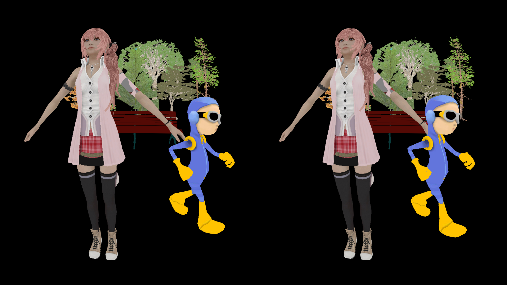

# Jassimp Model Loader and Animation

This sample shows a model loading application with skeletal animation. It loads a couple of models and display in a scene. The loaded animation is played for the boy model. The models are in different file formats: Collada, 3DS and OBJ. They are loaded from two sources: Android assets and a URL. Other sources such as SD Card and Linux filesystem are also supported. More than 40 3D file formats are supported by the importer we use.

It also shows how to add a custom texture decoder. The TGA format is shown in this demo.